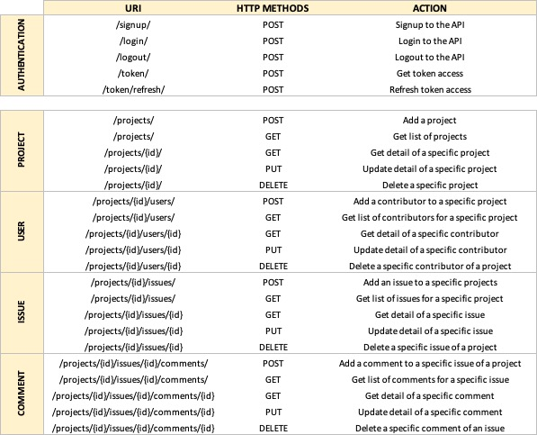
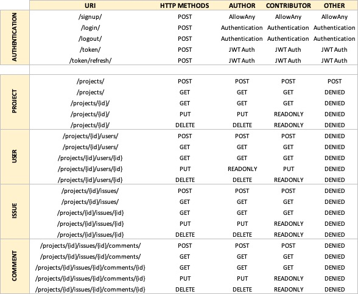

<div id="top"></div>

<!-- PROJECT SHIELDS -->
<!--
*** I'm using markdown "reference style" links for readability.
*** Reference links are enclosed in brackets [ ] instead of parentheses ( ).
*** See the bottom of this document for the declaration of the reference variables
*** for contributors-url, forks-url, etc. This is an optional, concise syntax you may use.
*** https://www.markdownguide.org/basic-syntax/#reference-style-links
-->
[![Contributors][contributors-shield]][contributors-url]
[![Forks][forks-shield]][forks-url]
[![Stargazers][stars-shield]][stars-url]
[![Issues][issues-shield]][issues-url]


<!-- PROJECT LOGO -->
<br />
<div align="center">

<h3 align="center">OC - PROJECT N°10 - RESTful API Using Django Rest Framework</h3>

  <p align="center">
   SoftDesk is an API for reporting and tracking technical issues. 
    <br />
    <a href="https://github.com/Jliezed/oc_project_9_litreview">View Demo</a>
    ·
    <a href="https://github.com/Jliezed/oc_project_9_litreview/issues">Report Bug</a>
    ·
    <a href="https://github.com/Jliezed/oc_project_9_litreview/issues">Request Feature</a>
  </p>
</div>


<!-- ABOUT THE PROJECT -->
## Project Overview


## Endpoints Summary


## Access Specification

#### Example
PUT : /projects/1/
- Author of the project can update the project 1
- Contributor of the project 1 can read only detail
- Other user of the API (not author or contributor) of project 1 can't access detail information of project 1


<p align="right">(<a href="#top">back to top</a>)</p>


## Built With

* Python 
* Django Rest Framework

<p align="right">(<a href="#top">back to top</a>)</p>


<!-- GETTING STARTED -->
## Getting Started

### Installation & Running the script

1. Clone the repo
   ```sh
   git clone https://github.com/Jliezed/oc_project_10_softdesk.git
   ```

### Create and activate a virtual environment
2. Go to your project directory
   ```sh
   cd oc_project_10_litreview
   ```
3. Install venv library (if not yet in your computer)
   ```sh
   pip install venv
   ```
4. Create a virtual environment
   ```sh
   python -m venv env
   ```
5. Activate the virtual environment
   ```sh
   source env/bin/activate
   ```
#### Install packages
6. Install the packages using requirements.txt
   ```sh
   pip install -r requirements.txt
   ```
#### Set environment variables
7. Create a copy of the file ".env.default" and rename it ".env"
8. Set value to the .env file:
   1. Define a secret key
   2. Debug to True for local development or False for production
   3. Allowed host equal to 127.0.0.1 for local environment

      ```sh
      SECRET_KEY='YOUR SECRET KEY'
      DEBUG=True
      ALLOWED_HOSTS=['127.0.0.1']
      ```

#### Run the server
   ```sh
   python manage.py runserver
   ```
9. Log to the API: http://127.0.0.1:8000/api/auth/login/
   ```sh
   User: toto
   Password: secret
   ```
10. Or create a superuser
   ```sh
   python manage.py createsuperuser
   ```

### Access the different endpoints
- http://127.0.0.1:8000/api/projects/
- http://127.0.0.1:8000/api/projects/1
- http://127.0.0.1:8000/api/projects/1/users/
- http://127.0.0.1:8000/api/projects/1/issues/
- http://127.0.0.1:8000/api/projects/1/issues/1
- http://127.0.0.1:8000/api/projects/1/issues/1/comments/
- http://127.0.0.1:8000/api/projects/1/issues/1/comments/1
---


<p align="right">(<a href="#top">back to top</a>)</p>


## API Documentation
- Postman: 
- Swagger: http://127.0.0.1:8000/api/docs/#/


<p align="right">(<a href="#top">back to top</a>)</p>


<!-- CONTACT -->
## Contact

Jliezed

Project Link: [https://github.com/Jliezed/oc_project_10_softdesk.git](https://github.com/Jliezed/oc_project_10_softdesk.git)

<p align="right">(<a href="#top">back to top</a>)</p>


<!-- MARKDOWN LINKS & IMAGES -->
<!-- https://www.markdownguide.org/basic-syntax/#reference-style-links -->
[contributors-shield]: https://img.shields.io/github/contributors/Jliezed/oc_project_10_softdesk.svg?style=for-the-badge
[contributors-url]: https://github.com/Jliezed/oc_project_10_softdesk/graphs/contributors
[forks-shield]: https://img.shields.io/github/forks/Jliezed/oc_project_10_softdesk.svg?style=for-the-badge
[forks-url]: https://github.com/Jliezed/oc_project_10_softdesk/network/members
[stars-shield]: https://img.shields.io/github/stars/Jliezed/oc_project_10_softdesk.svg?style=for-the-badge
[stars-url]: https://github.com/Jliezed/oc_project_10_softdesk/stargazers
[issues-shield]: https://img.shields.io/github/issues/Jliezed/oc_project_10_softdesk.svg?style=for-the-badge
[issues-url]: https://github.com/Jliezed/oc_project_10_softdesk/issues
[license-shield]: https://img.shields.io/github/license/Jliezed/oc_project_10_softdesk.svg?style=for-the-badge
[license-url]: https://github.com/Jliezed/oc_project_10_softdesk/blob/master/LICENSE.txt
[linkedin-shield]: https://img.shields.io/badge/-LinkedIn-black.svg?style=for-the-badge&logo=linkedin&colorB=555
[linkedin-url]: https://linkedin.com/in/linkedin_username
[product-screenshot]: images/screenshot.png
